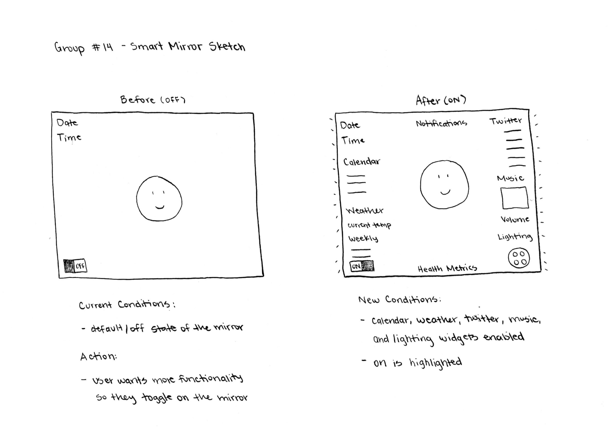

# Personal Smart Mirror
 
**Team Members:**

*Blaine Sieck – Group Leader*    
·      Came up with idea of the interface design  
·      Duties: Date, time, calendar event, on/off switch for the whole system, drag and drop
 
*Gabriel Costanzo*  
·      Duties: twitter feed, weather forecast (responsible for all the APIs)

*Eduardo Lozano*    
·      Duties: music controls/display, light controls settings

*Abdus Sami Yakoob*    
·      Duties: Reminders controls/display, health app controls/displays

**Links:**  

[Github Repo](https://github.com/BlaineSieck/Smart-Mirror-HCI) (e.g. https://github.com/BlaineSieck/Smart-Mirror-HCI)  
[Presentation Page](https://blainesieck.github.io/Smart-Mirror-HCI/.) (e.g. https://blainesieck.github.io/Smart-Mirror-HCI/., contains content of this README)
 
**Sketch Design:**

**Main Functions:**

time, date, schedule/calendar, current weather, weekly weather, health app (sleep, running etc.), reminders/notifications, twitter feed, music controls, lighting controls, on/off switch

**Implementation:**

We have divided the functions among our group members to develop individually. We meet once a week to go over what we have accomplished, merge our functions, and make changes to the design when necessary. As of now, the mirror will begin in an off state (only displaying the date and time) and then once it is turned on all of the other functions will become visible and active. You will be able to drag and drop items to any of the 4 edges of the mirror as long as they do not overlap with each other.

**Future Plans:**  

We will continue to make adjustments where necessary as we begin merging our functions. We need to figure out a grid to snap objects to and determine acceptable states for the mirror in terms of which functions can be on at the same time.

**Demo GIF:**  

